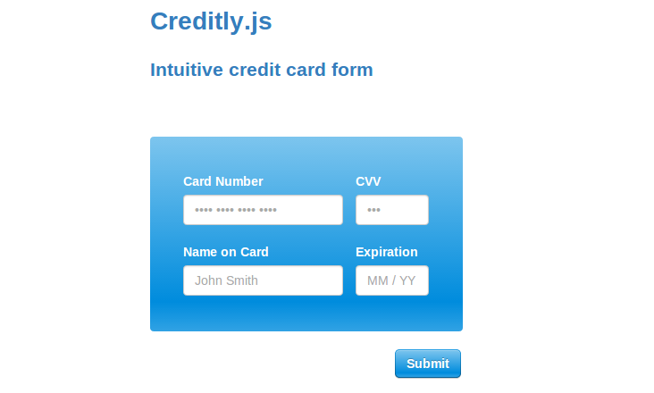

Creditly.js
========

An intuitive credit card form. Check out the [live demo](http://wangjohn.github.io/creditly/) to see Creditly.js in action.

[](http://wangjohn.github.io/creditly/)

Creditly.js gives you everything you need in order to create a sleek, intuitive credit card form. Just copy the html, css, and javascript to get an intuitive credit card form in seconds. You get credit card validation (using the Luhn algorithm) for free!

## Integration

To integrate, you just need to do the following things:

* Include the `creditly.js` javascript file (can be found under `src/creditly.js`).
```
<script type="text/javascript" src="creditly.js"></script>
```

* Include the `creditly.css` stylesheet file (can be found under `src/creditly.css`).
```
<link rel="stylesheet" href="creditly.css">
```

* Copy the HTML from the theme you'd like to use. You can find the stubs of HTML under the `src/themes` folder. For example, to use the `blue_theme`, you should take copy and paste the HTML from `src/themes/blue_theme.html`.
* Initialize from javascript.

        var creditly = Creditly.initialize(
            '.creditly-wrapper .expiration-month-and-year',
            '.creditly-wrapper .credit-card-number',
            '.creditly-wrapper .security-code',
            '.creditly-wrapper .card-type');

## Themes

Creditly supports multiple themes. Each can be used with the same CSS and javascript (`src/creditly.css` and `src/creditly.js`). However, the HTML for each theme can have slight differences. You can find the HTML for each of the themes under the `src/themes` folder.

Currently, Creditly.js supports the following themes (each can be viewed on the [demo website](http://wangjohn.github.io/creditly/)):

* `blue_theme`
* `gray_theme`

## Submitting A Form

When a user wants to submit a form, Creditly.js can be used to perform validation on the fields, and return an output of the results if the validation succeeded. An example usage would be the following:

```
var creditly = Creditly.initialize(
    '.creditly-wrapper .expiration-month-and-year',
    '.creditly-wrapper .credit-card-number',
    '.creditly-wrapper .security-code',
    '.creditly-wrapper .card-type');

$(".creditly-card-form .submit").click(function(e) {
  e.preventDefault();
  var output = creditly.validate();
  if (output) {
    // Do something with your credit card output.
    console.log(output["number"]);
    console.log(output["security_code"]);
    console.log(output["expiration_month"]);
    console.log(output["expiration_year"]);
  }
});
```

The first part of the above example instantiates the creditly object in the `creditly` variable. Then, whenever the `.creditly-card-form .submit` button is clicked, we perform a validation by using `creditly.validate()`.

The `creditly.validate` method will return one of two things:

* If the validation on either the credit card number, security code, or expiration date fails, then `false` will be returned. A `creditly_client_validation_error` event will be triggered on the HTML's `body` element, and the `has-error` class will be added to the input with the failing validation.
* If the validation on all the inputs succeeds, then an associative array with the properties will be returned:
  - `number`: The validated credit card number
  - `security_code`: The validated security code of the credit card (also known as the CVV)
` - `expiration_month`: The validated expiration month (integer between 1 and 12)
  - `expiration_year`: The validated expiration year (integer between 2000 and 2099)

### Errors in Validation

Whenever an error occurs after you call the `validate` method on a `Creditly` object, an event will be triggered on the HTML `body` element. This event, named `creditly_client_validation_error`, will contain a data object with the selectors of the inputs that failed validation and also the messages of the failed validation. The data has a `selectors` and a `messages` property.

If jQuery exists on the page, then a jQuery event will be triggered on the `body` element and can be accessed like so:

```
$("body").on("creditly_client_validation_error", function(e, data) {
  alert(data["messages"].join(", "));
});
```

If jQuery does not exist on the page, then a `MessageEvent` will be fired on the `body` element and can be accessed like so:

```
document.body.addEventListener("creditly_client_validation_error", function(e) {
  alert(e.data["messages"].join(", "));
}, false);
```

You can change the error messages by specifying the error messages upon `Creditly` object initialization. The `initialize` function can take a fourth options argument. The possible options are:

* `security_code_message` The message to display for an invalid security code
* `number_message` The message to display for invalid credit card numbers
*  `expiration_message` The message to display for an invalid expiration date

For example, we could initialize the `Creditly` object with different error messages like so:

```
var options = {
  "security_code_message": "Your security code was really wrong!",
  "expiration_message": "Check yo' expiration date yo!"
};
var creditly = Creditly.initialize(
    '.creditly-wrapper .expiration-month-and-year',
    '.creditly-wrapper .credit-card-number',
    '.creditly-wrapper .security-code',
    '.creditly-wrapper .card-type',
    options);
```

## Shameless Plug

This project is something that spun off of work at [Zinc](http://zinc.io), an API for making ecommerce purchases. Please check out the docs or contact support@zinc.io if you're interested!
